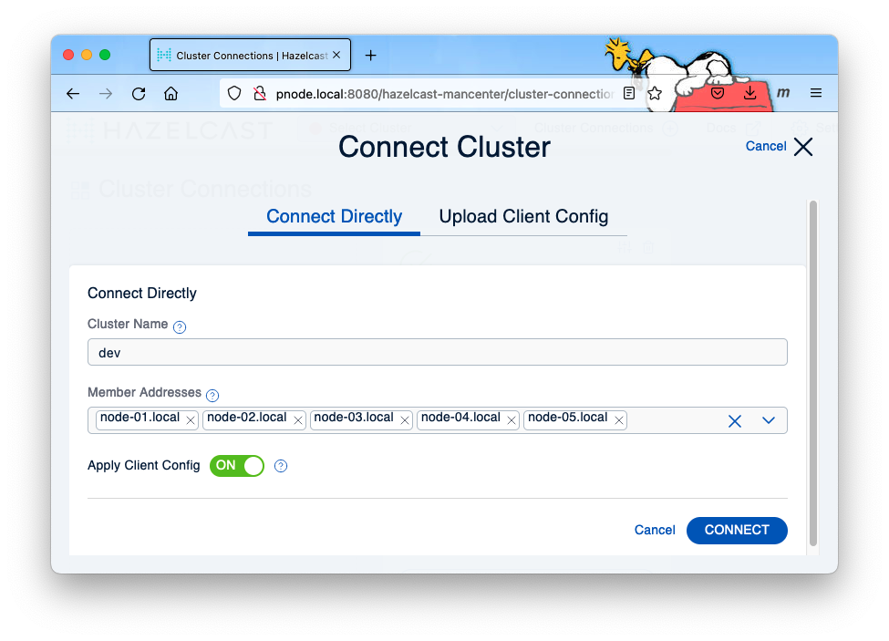

 [*PadoGrid*](https://github.com/padogrid) | [*Catalogs*](https://github.com/padogrid/catalog-bundles/blob/master/all-catalog.md) | [*Manual*](https://github.com/padogrid/padogrid/wiki) | [*FAQ*](https://github.com/padogrid/padogrid/wiki/faq) | [*Releases*](https://github.com/padogrid/padogrid/releases) | [*Templates*](https://github.com/padogrid/padogrid/wiki/Using-Bundle-Templates) | [*Pods*](https://github.com/padogrid/padogrid/wiki/Understanding-Padogrid-Pods) | [*Kubernetes*](https://github.com/padogrid/padogrid/wiki/Kubernetes) | [*Docker*](https://github.com/padogrid/padogrid/wiki/Docker) | [*Apps*](https://github.com/padogrid/padogrid/wiki/Apps) | [*Quick Start*](https://github.com/padogrid/padogrid/wiki/Quick-Start)

---

<!-- Platforms -->
[](https://github.com/padogrid/padogrid/wiki/Platform-Host-OS)

# Cluster Split-Brain

This bundle provides scripts, configuration files, and apps for creating a Hazelcast 4.x network split-brain environment where you can test Hazelcast's split-brain capabilities.

## Installing Bundle

```console
install_bundle -download bundle-hazelcast-4n5-app-perf_test_sb-cluster-sb
```

## Use Case

To prepare for encountering cluster split-brain situations, this use case provides step-by-step instructions for creating and monitoring a Hazelcast cluster split-brain. 


## Required Software

- [Vagrant](https://www.vagrantup.com/downloads) (1)
- [VirtualBox](https://www.virtualbox.org/) (1)
- [Hazelcast Desktop](https://github.com/netcrest/hazelcast-desktop) (2)
- [Hazelcast OSS](https://hazelcast.com/open-source-projects/downloads/archives/) (3)
- [Linux JDK](https://www.oracle.com/java/technologies/javase-downloads.html) (3)

1. This bundle uses PadoGrid pods which depend on Vagrant and VirtualBox. If you have not installed them, then please download and install them now by following the links. For details on PadoGrid pods, see [Understanding PadoGrid Pods](https://github.com/padogrid/padogrid/wiki/Understanding-Padogrid-Pods).
2. Hazelcast Desktop is integrated with PadoGrid. We will install it using `install_padogrid` later.
3. We need Hazelcast OSS and JDK for Linux in the VirtualBox VMs. We will install them later.

## Bundle Contents

```console
apps
└── perf_test_sb

clusters
└── sb
```

This bundle includes the following components.

- Cluster **sb**. The sb cluster is configured with five (5) VM members running in the `pod_sb` pod. It includes scripts that use `iptables` to drop TCP packets to split the `sb` cluster into two (2). It is configured with split-brain quorum rules for th following maps.

  - `nw/customers`
  - `nw/orders`

- App **perf_test_sb**. The `perf_test_sb` app is configured to run on a split cluster.

*Note that the `sb` cluster is configured to run in the `pod_sb` pod with its members running as VM hosts and not Vagrant pod hosts.*

## Installation Steps

We will be taking the following steps as we setup and run the environment.

- Install Linux products
- Create pod
- Build pod
- Build `perf_test_sb`
- Create `desktop`

Follow the instructions in the subsequent sections.

### Install Linux products

We need the following products installed before wen can setup Vagrant VMs. Download their tarball distributions by following the links.

- [Hazelcast OSS](https://hazelcast.com/open-source-projects/downloads/archives/)
- [Linux JDK](https://www.oracle.com/java/technologies/javase-downloads.html)

Assuming you have installed PadoGrid in the default directory, untar the downloaded tarballs in the `~/Padogrid/products/linux` directory as shown in the example below. If you have installed PadoGrid in a different directory, then make the appriate changes.

```bash
mkdir ~/Padogrid/products/linux
tar -C ~/Padogrid/products/linux -xzf  ~/Downloads/jdk-8u333-linux-x64.tar.gz
tar -C ~/Padogrid/products/linux -xzf  ~/Downloads/hazelcast-5.1.1-slim.tar.gz
```

### Create pod

Create a pod named `pod_sb` with five (5) data nodes. The pod name must be `pod_sb` since the bundle's cluster, `sb`, has been paired with that pod name. Take default values for all but the memory size which you can conserve by reducing it to 1024 MiB as shown in the ouput example below. The included `sb` cluster has been preconfigured with the member max heap size of 512 MiB.

```console
create_pod -pod pod_sb
```

**Input:**

Take the default values except for the following prompts.

```console
Primary node memory size in MiB [2048]: 1024
Data node memory size in MiB [2048]: 1024
Number of data nodes  [2]: 5
Products installation directory path: /Users/dpark/Padogrid/products/linux
Install Avahi? true
```

**Output:**

```console
Please answer the prompts that appear below. You can abort this command at any time
by entering 'Ctrl-C'.

Pod name [pod_sb]:
Primary node name [pnode]:
Data node name prefix [node]:
This machine has the following IP addresses. Choose one from the list. The IP address
must be a private IP address.
192.168.56.1
Host private IP address [192.168.56.1]:
First node IP address' octect [10]:
Primary node memory size in MiB [2048]: 1024
Data node memory size in MiB [2048]: 1024
Number of data nodes  [2]: 5
Products installation directory path.
[/Users/dpark/Padogrid/products]:
/Users/dpark/Padogrid/products/linux
Install Avahi? This allows VMs to enable local network discovery service via
the mDNS/DNS-SD protocol. All VM host names can be looked up with the suffix
'.local', i.e., pnode.local, node-01.local, etc.
Enter 'true' or 'false' [false]: true
Vagrant box image [ubuntu/trusty64]:

You have entered the following.
                       Pod name: pod_sb
              Primary node name: pnode
          Data node name prefix: node
        Host private IP address: 192.168.56.1
      Node IP addres last octet: 10
 Primary node memory size (MiB): 1024
    Data node memory size (MiB): 1024
                Data node count: 5
             Products directory: /Users/dpark/Padogrid/products/linux
                  Avahi enabled: true
              Vagrant box image: ubuntu/trusty64
Enter 'c' to continue, 'r' to re-enter, 'q' to quit: c
```

### Build pod

Build the pod you just created.
 
```console
# Build and start the pod
build_pod -pod pod_sb
```

### Configuring Cluster

#### Memory

If you changed the default memory size of the primary and data nodes when you created the pod, then you can adjust the Hazelcast member min/max heap size in the `etc/cluster.properties` file as follows:

```console
switch_cluster sb
vi etc/cluster.properties
```

Change the heap min/max sizes in the `etc/cluster.properties` file. The heap size of 512 MB suffices our needs.

```properties
# Heap min and max values in etc/cluster.properties
heap.min=512m
heap.max=512m
```

#### hazelcast.xml

:exclamation: Starting Hazelcast 4.2, this element must be set to `true` for `LatestUpdateMergePolicy`. If your Hazelcast version number is less than 4.2 then you must remove the `per-entry-stats-enabled` element from the `hazelcast.xml` file.

```bash
cd_cluster sb
vi etc/hazelcast.xml
```

**hazelcast.xml (4.2 or later):**

```xml
<hazelcast ...>
...
    <merge-policy batch-size="100">LatestUpdateMergePolicy</merge-policy>
    <per-entry-stats-enabled>true</per-entry-stats-enabled>
    ...
</hazelcast>
```

**hazelcast.xml (4.1.5 or prior):**

```xml
<hazelcast ...>
...
    <merge-policy batch-size="100">LatestUpdateMergePolicy</merge-policy>
    ...
</hazelcast>
```

## Creating Split-Brain

### 1. Start cluster and Management Center

Login to `pnode.local` and start the `sb` cluster as follows:

```console
cd_pod pod_sb
vagrant ssh
# If prompts for password:
password: vagrant

# Once logged in to Varant VM, pnode, execute the following:
switch_cluster sb
start_cluster
start_mc
```

### 2. Monitor Management Center

Enter the following URL in your browser to monitor the Hazelcast cluster from the Management Center.

[http://pnode.local:8080/hazelcast-mancenter](http://pnode.local:8080/hazelcast-mancenter)

Create a cluster connection to the **dev** cluster using any of the members, i.e., `node-01.local`, `node-02.local`, etc. 



### 3. Ingest data - `perf_test_sb`

From your host OS, build `perf_test_sb` and run `test_group` as follows:

```console
cd_app perf_test_sb; cd bin_sh
./build_app
./test_group -prop ../etc/group-factory.properties -run
```

### 4. View data - `desktop`

If you haven't installed the Hazelcast Desktop, then install it on your host OS as shown below.

```bash
install_padogrid -product hazelcast-desktop
update_padogrid -product hazelcast-desktop
```

Once installed, create and run the `desktop` app as follows:

```console
create_app -app desktop -name desktop_sb
cd_app desktop_sb/bin_sh
./desktop
```

You can enter any of the member addresses for the `Locators` text field when you login from the desktop. For example, `node-01.local:5701` connects to the `node-01.local` member. `User Name` is required and can be any name. `Password` is optional and ignored.

```console
Locators: node-01.local:5701
App ID: sys
User Name: foo
Password: <leave blank>
```

### 5. Split cluster

From `pnode.local`, run `split_cluster` as follows:

```console
switch_cluster sb; cd bin_sh
./split_cluster
```

To see the `iptables` rules set by `split_cluster`, run `list_rules` as follows:

```console
./list_rules
```

### 6. From `pnode.local`, monitor the log files to see the cluster splits into two (2) as follows:

| Cluster | Nodes                                       |
| ------- | ------------------------------------------- |
| A       | node-01.local, node-02.local                |
| B       | node-03.local, node-04.local, node-05.local |

```console
# See Cluster A (view node-01.local or node-02.local log file)
show_log

# See Cluster B (view node-03.local, node-04.local, node-05.local log file)
show_log -num 5
```

You should see something like the following in the log files:

**Cluster A**

```console
...
2021-01-28 16:22:04 INFO  ClusterService:180 - [node-01.local]:5701 [dev] [4.1.1]

Members {size:2, ver:8} [
    Member [node-02.local]:5701 - 851758de-18e4-489d-9caa-7b0fde9d1486
    Member [node-01.local]:5701 - 131cc2d9-7d4e-4047-87b8-c675f2cfcb4c this
]
...
2021-01-28 16:22:04 WARN  InternalPartitionService:180 - [node-01.local]:5701 [dev] [4.1.1] Following unknown addresses are found in partition table sent from master[[node-02.local]:5701]. (Probably they have recently joined or left the cluster.) {
    [node-03.local]:5701 - 70b83cf3-26bf-4c59-9ef8-d961839f084d
    [node-05.local]:5701 - 20b77d72-9c81-496a-b2fd-bda5fa89b6a8
}
...
```

**Cluster B**

```console
...
2021-01-28 16:22:08 INFO  ClusterService:180 - [node-05.local]:5701 [dev] [4.1.1]

Members {size:3, ver:6} [
    Member [node-03.local]:5701 - 70b83cf3-26bf-4c59-9ef8-d961839f084d
    Member [node-04.local]:5701 - 80f7e869-0b3d-4e2d-8ad0-9164cc1b3844
    Member [node-05.local]:5701 - 20b77d72-9c81-496a-b2fd-bda5fa89b6a8 this
]
...
2021-01-28 16:22:08 WARN  InternalPartitionService:180 - [node-05.local]:5701 [dev] [4.1.1] Following unknown addresses are found in partition table sent from master[[node-04.local]:5701]. (Probably they have recently joined or left the cluster.) {
    [node-01.local]:5701 - 131cc2d9-7d4e-4047-87b8-c675f2cfcb4c
    [node-02.local]:5701 - 851758de-18e4-489d-9caa-7b0fde9d1486
}
...
```

Try refreshing the management center from your browser. You should see the list of members changing sporadically indicating there is a network issue.

### 7. Ingest data into Cluster B - `perf_test_sb`

From your host OS, run `test_group` which has been preconfigured to connect to Cluster B, i.e., node-03.local, node-04.local, node-05.local (see `etc/hazelcast-client.xml`). `test_group` updates the data that was inserted earlier. We'll compare the new data with the old data in the split clusters.

```console
cd_app perf_test_sb; cd bin_sh
./test_group -prop ../etc/group-factory.properties -run
```

### 8. Compare data between Cluster A and Cluster B

   - Launch desktop and login to Cluster A, e.g., `node-01.local:5701`
   - Launch desktop and login to Cluster B, e.g., `node-05.local:5701`

```console
cd_app desktop_sb/bin_sh

# Launch two (2) instances of desktop

# login to node-01.local:5701
./desktop

# login to node-05.local:5701
./desktop
```

### 9. Execute queries on both desktop instances

Execute queries on both desktop instances so that we can compare the results later when we merge the clusters.

```console
--- From each desktop instacne, execute the following queries
--- (Note that the desktop supports SQL comments):
select * from nw/customers order by customerId;
select * from nw/orders order by orderId;
```

When you execute the above queries you should see the following behavior:

Map          | Cluster A                 | Cluster B     |
------------ | ------------------------- | ------------- |
nw/customers | Query Success             | Query Success |
nw/orders    | Query Failure (Exception) | Query Success |

**Query Exception:** *com.hazelcast.quorum.QuorumException: Split brain protection exception: quorumRuleWithThreeMembers has failed!*

The exception occurs in Cluster A because the split-brain quorum size for the `nw/customers` map is configured with two (2) as shown below (See `etc/hazelcast.xml`). The `nw/orders` map is configured with the the minimum size of 3 but Cluster A now has only 2 members.

You can view the `hazelcast.xml` file as follows:

```console
cd_cluster sb
less etc/hazelcast.xml
```

Output:

```xml
...
	<split-brain-protection name="quorumRuleWithTwoMembers" enabled="true">
		<minimum-cluster-size>2</minimum-cluster-size>
	</split-brain-protection>
	<split-brain-protection name="quorumRuleWithThreeMembers" enabled="true">
		<minimum-cluster-size>3</minimum-cluster-size>
	</split-brain-protection>

    <map name="nw/customers">
		<merge-policy batch-size="100">LatestUpdateMergePolicy</merge-policy>
		<split-brain-protection-ref>quorumRuleWithTwoMembers</split-brain-protection-ref>
    </map>
    <map name="nw/orders">
        <merge-policy batch-size="100">LatestUpdateMergePolicy</merge-policy>
		<split-brain-protection-ref>quorumRuleWithThreeMembers</split-brain-protection-ref>
    </map>
...
```

### 10. Merge clusters

From `pnode.local`, run `merge_cluster` as follows:

```console
switch_cluster sb; cd bin_sh
./merge_cluster
```

### 11. Monitor merged cluster

```console
show_log
```

Upon a successful merge, which takes about a minute, you should see something like the following in all the log files:

```console
...
2021-01-28 16:55:04 INFO  ClusterService:180 - [node-01.local]:5701 [dev] [4.1.1]

Members {size:5, ver:11} [
	Member [node-04.local]:5701 - 80f7e869-0b3d-4e2d-8ad0-9164cc1b3844
	Member [node-05.local]:5701 - 20b77d72-9c81-496a-b2fd-bda5fa89b6a8
	Member [node-03.local]:5701 - 70b83cf3-26bf-4c59-9ef8-d961839f084d
	Member [node-02.local]:5701 - 776e0384-a22c-44cb-aa76-3ae70650b989
	Member [node-01.local]:5701 - abbefe8f-4744-40e3-b632-6ddfd328f0cf this
]
...
```

The management center should also show five (5) members.

### 12. Compare data between the merged cluster and Cluster B

The merged cluster should have the exact same data as Cluster B since both maps are configured with `LatestUpdateMergePolicy`.

From the node-01.local desktop, i.e., Cluster A, re-execute the query, `select * from nw/orders order by orderId`. You should now see the query successfully returns results now that Cluster A and Cluster B are merged into one.

## Teardown

### Stop Cluster

From your host OS or any of the pods, execute the following:

```console
stop_cluster -cluster sb
stop_mc -cluster sb
```

### Stop Pod

From your host OS, execute the following:

```console
# This stops the VMs. You can restart them by running 'start_pod' later.
stop_pod -pod pod_sb
```

### Remove Pod

From your host OS, execute the following:

```console
# This removes the Vagrant VMs.
remove_pod -pod pod_sb
```

### Close Desktop

Close `desktop` app instances by clicking on the close icon.

---

 [*PadoGrid*](https://github.com/padogrid) | [*Catalogs*](https://github.com/padogrid/catalog-bundles/blob/master/all-catalog.md) | [*Manual*](https://github.com/padogrid/padogrid/wiki) | [*FAQ*](https://github.com/padogrid/padogrid/wiki/faq) | [*Releases*](https://github.com/padogrid/padogrid/releases) | [*Templates*](https://github.com/padogrid/padogrid/wiki/Using-Bundle-Templates) | [*Pods*](https://github.com/padogrid/padogrid/wiki/Understanding-Padogrid-Pods) | [*Kubernetes*](https://github.com/padogrid/padogrid/wiki/Kubernetes) | [*Docker*](https://github.com/padogrid/padogrid/wiki/Docker) | [*Apps*](https://github.com/padogrid/padogrid/wiki/Apps) | [*Quick Start*](https://github.com/padogrid/padogrid/wiki/Quick-Start)
